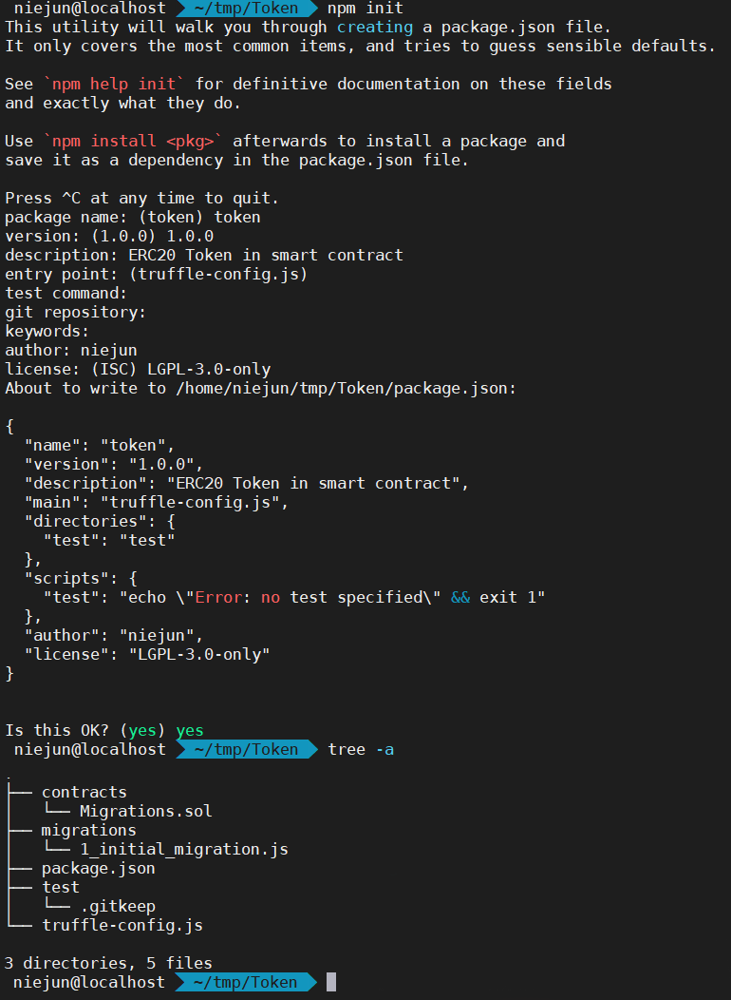

# 发行自己的 ERC20 代币

> 依赖库：[OpenZeppelin](https://github.com/OpenZeppelin/openzeppelin-contracts) - ERC20 标准兼容代笔的实现，包含融资上限、拍卖、行权计划和其他更复杂的功能

## 初始化

~~~shell
mkdir Token  	# 新建Token项目目录
cd Token     	# 进入Token项目目录
truffle init  	# 初始化truffle项目
npm init  		# 初始化为node.js项目
~~~

`truffle init` 执行结果 与目录结构如下

`npm init` 执行结果 与 目录结构如下(只是自定义了 **package.json** )

> npm init时输入的 license可以在 [SPDX许可证标识符的完整列表](https://spdx.org/licenses/) 查看

 

## 安装 OpenZeppelin

~~~shell
npm install openzeppelin-solidity@1.12.0
~~~

> 安装完成会自动在 `package.json`加上 指定版本的openzeppelin 依赖
>
>   "dependencies": {
>             "openzeppelin-solidity": "^1.12.0"
>           }

## 新建代币合约

新建 METoken.sol 文件，写入一下内容

~~~solidity
pragma solidity ^0.4.21;

import "openzeppelin-solidity/contracts/token/ERC20/StandardToken.sol";

contract METoken is StandardToken {
    string public constant name='this is a token';
    string public constant symbol='met';
    uint8 public constant decimals =2;
    uint constant _initial_supply = 21000000000;

    function METoken() public{
        totalSupply_ = _initial_supply;
        balances[msg.sender] = _initial_supply;
        emit Transfer(address(0), msg.sender, _initial_supply);
    }
}
~~~

> standardToken.sol 在**/xxx/Token/node_modules/openzeppelin-solidity/contracts/token/ERC20/StandardToken.sol**

## 创建启动脚本

新建 truffle-config.js，写入一下内容

~~~js
module.exports = {
  // See <http://truffleframework.com/docs/advanced/configuration>
  // for more about customizing your Truffle configuration!
  networks: {
      //本地私有链网络 ganache
    ganache: {
      host: "169.254.255.227",
      port: 7545,
      network_id: "5777" // 自定义
    },
    development: {
      host: "222.201.139.45",
      port: 7545,
      network_id: "*" // Match any network id
    },
    develop: {
      port: 8545
    }
  },
  //设置solidity编译器版本号
  compilers: {
    solc: {
      version: "0.4.24"
    }
  }
};

~~~

> 有时truffle自带的**solidity编译器版本**与.sol文件**不一致**时，可通过 compilers 指定solidity编译器版本号

## 编译合约

~~~shell
truffle migrate

## 执行结果
Compiling your contracts...
===========================
> Compiling ./contracts/METoken.sol
> Compiling ./contracts/Migrations.sol
> Compiling openzeppelin-solidity/contracts/math/SafeMath.sol
> Compiling openzeppelin-solidity/contracts/token/ERC20/BasicToken.sol
> Compiling openzeppelin-solidity/contracts/token/ERC20/ERC20.sol
> Compiling openzeppelin-solidity/contracts/token/ERC20/ERC20Basic.sol
> Compiling openzeppelin-solidity/contracts/token/ERC20/StandardToken.sol
> Compilation warnings encountered:

    /home/niejun/gitpro/Dapp/Token/contracts/METoken.sol:11:5: Warning: Defining constructors as functions with the same name as the contract is deprecated. Use "constructor(...) { ... }" instead.
    function METoken() public{
    ^ (Relevant source part starts here and spans across multiple lines).

> Artifacts written to /home/niejun/gitpro/Dapp/Token/build/contracts
> Compiled successfully using:
   - solc: 0.4.24+commit.e67f0147.Emscripten.clang
~~~

## 启动私有链

> 此处使用 Ganache，也可使用geth客户端(注意开放RPC)

## 部署合约到私有链

~~~shell
truffle migrate --network ganache

## 执行结果
Compiling your contracts...
===========================
> Everything is up to date, there is nothing to compile.

Starting migrations...
======================
> Network name:    'ganache'
> Network id:      5777
> Block gas limit: 6721975 (0x6691b7)

1_initial_migration.js
======================

   Deploying 'Migrations'
   ----------------------
   > transaction hash:    0xc7bbe8f5ad5c77cfa7f9ad3f247b5525338a697d2b1d9529f3a2fa6ffa6ebf97
   > Blocks: 0            Seconds: 0
   > contract address:    0x663909CF38250786A51351016489AfF2A20696eC
   > block number:        1
   > block timestamp:     1600753327
   > account:             0x0b0f997716b4Ea998bF9e131b1DBA6e44182Ac20
   > balance:             99.99592882
   > gas used:            203559 (0x31b27)
   > gas price:           20 gwei
   > value sent:          0 ETH
   > total cost:          0.00407118 ETH

   > Saving migration to chain.
   > Saving artifacts
   -------------------------------------
   > Total cost:          0.00407118 ETH

2_deploy_contracts.js
=====================

   Deploying 'METoken'
   -------------------
   > transaction hash:    0x98b8273b0348201f4f5fad9e7ba8f0f2ee373b2e752eb02f9b9fd32e318be59d
   > Blocks: 0            Seconds: 0
   > contract address:    0x4DF34196e881b1963f8Ac7c2643Bd36Fe1B01AF9
   > block number:        3
   > block timestamp:     1600753328
   > account:             0x0b0f997716b4Ea998bF9e131b1DBA6e44182Ac20
   > balance:             99.97308238
   > gas used:            1099993 (0x10c8d9)
   > gas price:           20 gwei
   > value sent:          0 ETH
   > total cost:          0.02199986 ETH

   > Saving migration to chain.
   > Saving artifacts
   -------------------------------------
   > Total cost:          0.02199986 ETH

Summary
=======
> Total deployments:   2
> Final cost:          0.02607104 ETH
~~~

## 进入交互式命令行

~~~shell
xx@localhost $ truffle console --network ganache
truffle(ganache)> METoken.address  # 获取合约地址
'0xDA32541457CC0601Aa5ca76f3c91b04F670ab709'

~~~

# 项目使用方法

- 开启私有链

- 修改 truffle-config.js的私有链地址、端口号、网络号

- ~~~shell
  npm install
  truffle compile
  truffle migrate --network ganache
  ~~~

- ing

