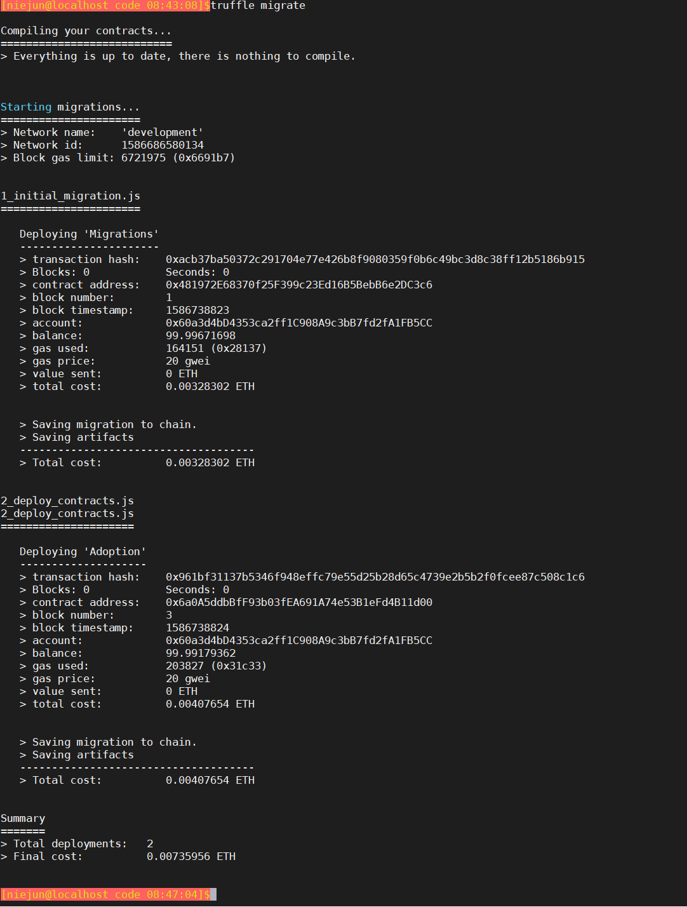
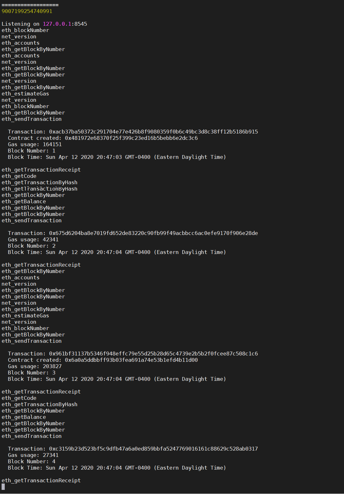
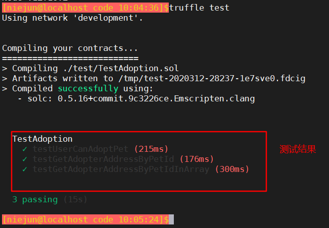
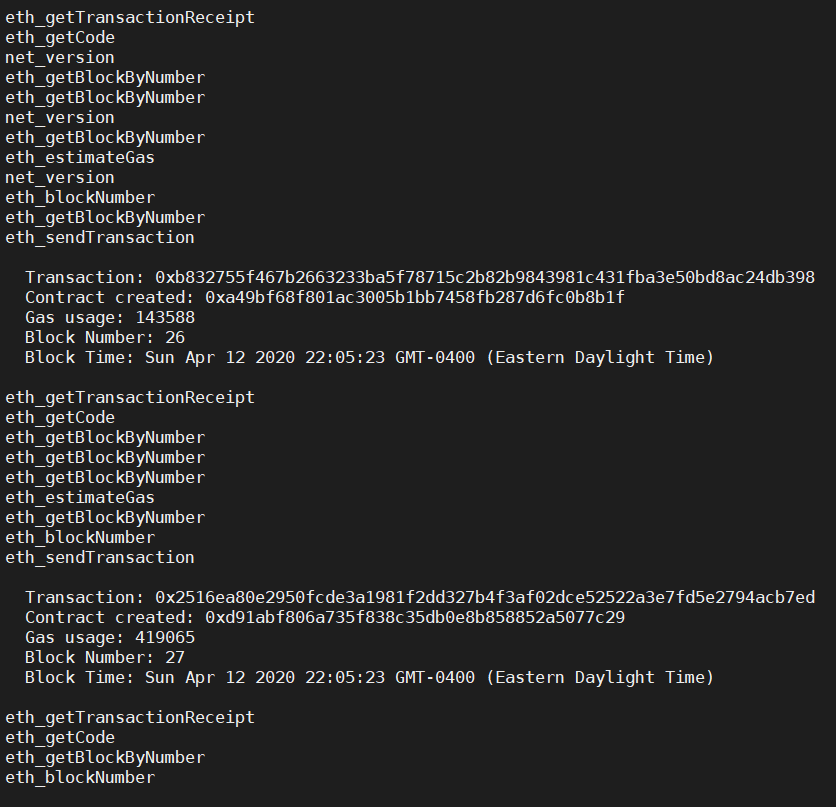
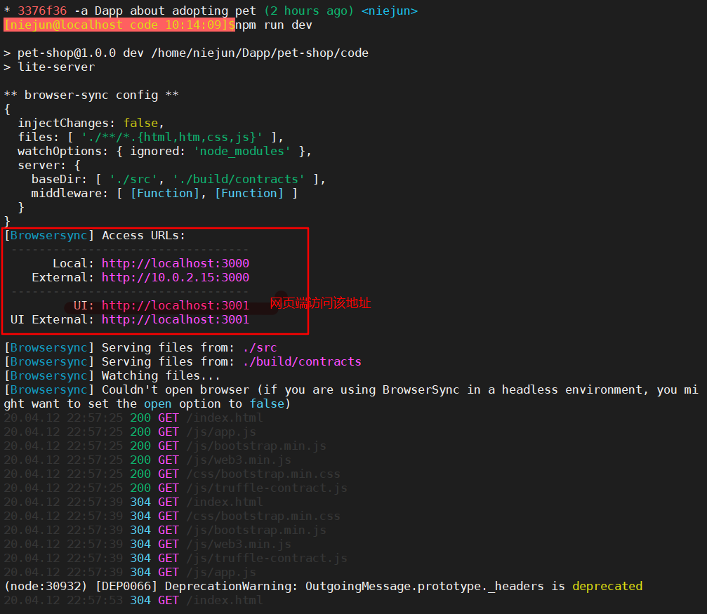

# Truffle 教程：教你开发、部署第一个去中心化应用(Dapp) - 宠物商店

> 原文链接： https://learnblockchain.cn/2018/01/12/first-dapp     2018-1-12  [原帖部分代码由于编译器版本问题需要修改]
>
> 子链接：[开发链上记事本 ](https://learnblockchain.cn/2019/03/30/dapp_noteOnChain/)   2019-03-20
>
> 子链接2： [使用Truffle开发以太坊投票DAPP](https://learnblockchain.cn/2019/04/10/election-dapp/) 2019-04-10

今天我们来编写一个完整的去中心化（区块链）应用（Dapps）, 本文可以和[编写智能合约](https://learnblockchain.cn/2017/11/24/init-env/)结合起来看。
2019/03/30 更新：

1. 适配 Truffle v5.0.0;
2. 更新 [Solidity](https://learnblockchain.cn/docs/solidity/) 代码，适配 solidity 0.5.0 以上版本;
3. 适配 MetaMask 更新， 适配支持 `window.ethereum` 对象;

## 写在前面

阅读本文前，你应该对以太坊、智能合约有所了解，如果你还不了解，建议你先看[以太坊是什么](https://learnblockchain.cn/2017/11/20/whatiseth/)
除此之外，你最好还了解一些 HTML 及 JavaScript 知识。

本文通过实例教大家来开发去中心化应用，应用效果如图：


从本文，你可以学习到：

- 搭建[智能合约](https://learnblockchain.cn/2018/01/04/understanding-smart-contracts/)开发环境
- 创建 [Truffle](https://learnblockchain.cn/docs/truffle/) 项目
- 编写智能合约
- 编译和部署智能合约到区块链
- 如何通过 Web3 和智能合约交互
- MetaMask 的使用

## 项目背景

Pete 有一个宠物店，有 16 只宠物，他想开发一个去中心化应用，让大家来领养宠物。
在 truffle box 中，已经提供了 pet-shop 的网站部分的代码，我们只需要编写合约及交互部分。

## 环境搭建

1. 安装 [Node](https://nodejs.org/en/download/)   node.js，安装参考 [node.js安装]( https://github.com/Komari-Koshigaya/general-command/#node.js)
2. 安装 Truffle ：`npm install -g truffle`    #  truffle -v 显示版本号则代表安装成功
3. 安装 [Ganache](http://truffleframework.com/ganache/) 官网进不去可 [github编译](https://github.com/trufflesuite/ganache)   

> Ganache（或 Ganache CLI）已经取代了 testrpc，Ganache是一个可以部署到私链的以太坊客户端，用于测试和开发的快速以太坊RPC客户端，其目前有两个版本：图形界面的版本(windows)和命令行版本。
>
> 命令行版本ganache-cli：输入`sudo npm install -g ganache-cli`

## 创建项目

1. 建立项目目录并进入

```shell
> mkdir pet-shop-tutorial
> cd pet-shop-tutorial
```

1. 使用 truffle unbox 创建项目

```shell
 > truffle unbox pet-shop
 Downloading...
 Unpacking...
 Setting up...
 Unbox successful. Sweet!

Commands:

  Compile:        truffle compile
  Migrate:        truffle migrate
  Test contracts: truffle test
  Run dev server: npm run dev
```

这一步需要等待一会

> 也可以使用 truffle init 来创建一个全新的项目。Truffle 的使用可以参阅[这份文档](https://learnblockchain.cn/docs/truffle/) 。

## 项目目录结构

`contracts/` 智能合约的文件夹，所有的智能合约文件都放置在这里，里面包含一个重要的合约 Migrations.sol（稍后再讲）
`migrations/` 用来处理部署（迁移）智能合约 ，迁移是一个额外特别的合约用来保存合约的变化。
`test/` 智能合约测试用例文件夹
`truffle.js/` 配置文件

其他代码可以暂时不用管

## 编写智能合约

智能合约承担着分布式应用的后台逻辑和存储。智能合约使用 solidity 编写，可阅读
[solidity 系列文章](https://learnblockchain.cn/categories/ethereum/Solidity/)

在 contracts 目录下，添加合约文件 Adoption.sol

```js
pragma solidity ^0.5.0;

contract Adoption {

  address[16] public adopters;  // 保存领养者的地址

    // 领养宠物
  function adopt(uint petId) public returns (uint) {
    require(petId >= 0 && petId <= 15);  // 确保id在数组长度内

    adopters[petId] = msg.sender;        // 保存调用这地址
    return petId;
  }

  // 返回领养者
  function getAdopters() public view returns (address[16] memory) {
    return adopters;
  }

}
```

## 编译部署智能合约

[Truffle](https://learnblockchain.cn/docs/truffle/) 集成了一个[开发者控制台](https://learnblockchain.cn/docs/truffle/getting-started/using-truffle-develop-and-the-console.html)，可用来生成一个开发链用来测试和部署智能合约。

### 编译

Solidity 是编译型语言，需要把可读的 Solidity 代码编译为 EVM 字节码才能运行。
dapp 的根目录 pet-shop-tutorial 下

```shell
> truffle compile
```

输出

```
Compiling ./contracts/Adoption.sol...
Writing artifacts to ./build/contracts
```

### 开启私链

在执行部署之前，需要确保有一个区块链运行， 可以使用
[Ganache](http://truffleframework.com/ganache/) 来开启一个私链来进行开发测试，默认会在 7545 端口上运行一个开发链。
Ganache 启动之后是这样：


> 若使用命令行版本ganache-cli，启动ganache-cli操作如下：
>
> 输入`ganache-cli`，显示如下，ganache默认创建10个账户，每个账户有100个ETH。
>
> 
>
> 通过该方法启动后，由于ganache-cli需要监听交易信息，因此需要另开一个终端。
>
> #### 执行下一步部署时，由于命令行开启的端口不一致，需要修改 truffle-config.js 对应的port
>
> 根据上图客户端的监听地址修改truffle-config.js为以下：
>
> module.exports = {
> // See <http://truffleframework.com/docs/advanced/configuration>
> // for more about customizing your Truffle configuration!
> networks: {
>  development: {
>    host: "127.0.0.1",
>    port: 7545,
>    network_id: "*" // Match any network id
>  },
>  develop: {
>    port: 8545
>  }
> }
> };
>
> ### ganache-cli指定端口和监听地址
>
> ganache-cli -p 7878   # 指定端口为 7878
>
> ganache-cli -h 127.0.0.1  # 将启动ganache-cli在地址`127.0.0.1`监听，这样只有本机上的应用才可以访问仿真节点
>
> ganache-cli -h 127.0.0.1 -p 7878  # 启动ganache-cli在地址`127.0.0.1`的7878端口监听

### 部署

编译之后，就可以部署到区块链上。
在 migrations 文件夹下已经有一个 1_initial_migration.js [部署脚本](https://learnblockchain.cn/docs/truffle/getting-started/running-migrations.html)，用来部署 Migrations.sol 合约。
Migrations.sol 用来确保不会部署相同的合约。

现在我们来创建一个自己的部署脚本 `2_deploy_contracts.js`

```
var Adoption = artifacts.require("Adoption");

module.exports = function(deployer) {
  deployer.deploy(Adoption);
};
```

接下来执行部署命令(需要在项目的根目录)：

```bash
> truffle  migrate
```

执行后，有一下类似的输出，



在打开的 Ganache 里可以看到区块链状态的变化，现在产生了 4 个区块。

这时说明已经智能合约已经部署好了。

> ganache-cli启动的命令行终端，可以看到也产生了4笔交易和4个区块
>
> 

## 测试

现在我们来测试一下智能合约，测试用例可以用 JavaScript 或 Solidity 来编写，这里使用 Solidity。

在 `test` 目录下新建一个 `TestAdoption.sol`，[编写测试合约](https://learnblockchain.cn/docs/truffle/testing/writing-tests-in-solidity.html)

```js
pragma solidity ^0.5.0;

import "truffle/Assert.sol";   // 引入的断言
import "truffle/DeployedAddresses.sol";  // 用来获取被测试合约的地址
import "../contracts/Adoption.sol";      // 被测试合约

contract TestAdoption {
  Adoption adoption = Adoption(DeployedAddresses.Adoption());

  // 领养测试用例
  function testUserCanAdoptPet() public {
    uint returnedId = adoption.adopt(8);

    uint expected = 8;
    Assert.equal(returnedId, expected, "Adoption of pet ID 8 should be recorded.");
  }

  // 宠物所有者测试用例
  function testGetAdopterAddressByPetId() public {
    // 期望领养者的地址就是本合约地址，因为交易是由测试合约发起交易，
    address expected = address(this);//原帖使用不符合当前编译器版本规范
    address adopter = adoption.adopters(8);
    Assert.equal(adopter, expected, "Owner of pet ID 8 should be recorded.");
  }

    // 测试所有领养者
  function testGetAdopterAddressByPetIdInArray() public {
  // 领养者的地址就是本合约地址
    address expected = address(this);//原帖使用不符合当前编译器版本规范
    address[16] memory adopters = adoption.getAdopters();
    Assert.equal(adopters[8], expected, "Owner of pet ID 8 should be recorded.");
  }
}
```

提示：Assert.sol 及 DeployedAddresses.sol 是 [Truffle 框架](https://learnblockchain.cn/docs/truffle/)提供，在 test 目录下并不提供 truffle 目录。

TestAdoption 合约中添加 adopt 的测试用例。

### 运行测试用例

在终端中，执行

```bash
truffle test
```

如果测试通过，则终端输出：



> ganache-cli终端窗口显示：
>
> 

## 创建用户接口和智能合约交互

我们已经编写和部署及测试好了我们的合约，接下我们为合约编写 UI，让合约真正可以用起来。

在 Truffle Box `pet-shop` 里，已经包含了应用的前端代码，代码在 `src/` 文件夹下。

在编辑器中打开 `src/js/app.js`

可以看到用来管理整个应用的 App 对象，init 函数加载宠物信息，就初始化 [web3](https://github.com/ethereum/web3.js/).
web3 是一个实现了与[以太坊](https://learnblockchain.cn/2017/11/20/whatiseth/)节点通信的库，我们利用 web3 来和合约进行交互。

### 初始化 web3

接下来，我们来编辑 app.js 修改 initWeb3():
删除注释，修改为：

```js
  initWeb3: function() {

    // Modern dapp browsers...
    if (window.ethereum) {
      App.web3Provider = window.ethereum;
      try {
        // Request account access
        await window.ethereum.enable();
      } catch (error) {
        // User denied account access...
        console.error("User denied account access")
      }
    }
    // Legacy dapp browsers...
    else if (window.web3) {
      App.web3Provider = window.web3.currentProvider;
    }
    // If no injected web3 instance is detected, fall back to Ganache
    else {
      App.web3Provider = new Web3.providers.HttpProvider('http://localhost:7545');
    }
    web3 = new Web3(App.web3Provider);

    return App.initContract();
  }
```

新的 Dapp 浏览器或 MetaMask 的新版本，注入了一个 `ethereum` 对象到 `window` 对象里， 应该优先使用 `ethereum` 来构造 web3， 同时使用 `ethereum.enable()` 来请求用户授权访问链接账号。

代码中优先使用 [Mist](https://github.com/ethereum/mist) 或 [MetaMask](https://metamask.io/) 提供的 web3 实例，如果没有则从本地环境创建一个。

### 实例化合约

使用 truffle-contract 会帮我们保存合约部署的信息，就不需要我们手动修改合约地址，修改 initContract()代码如下：

```js
initContract: function() {
  // 加载Adoption.json，保存了Adoption的ABI（接口说明）信息及部署后的网络(地址)信息，它在编译合约的时候生成ABI，在部署的时候追加网络信息
  $.getJSON('Adoption.json', function(data) {
    // 用Adoption.json数据创建一个可交互的TruffleContract合约实例。
    var AdoptionArtifact = data;
    App.contracts.Adoption = TruffleContract(AdoptionArtifact);

    // Set the provider for our contract
    App.contracts.Adoption.setProvider(App.web3Provider);

    // Use our contract to retrieve and mark the adopted pets
    return App.markAdopted();
  });
  return App.bindEvents();
}
```

### 处理领养

修改 markAdopted()代码：

```js
  markAdopted: function(adopters, account) {
    var adoptionInstance;

    App.contracts.Adoption.deployed().then(function(instance) {
      adoptionInstance = instance;

      // 调用合约的getAdopters(), 用call读取信息不用消耗gas
      return adoptionInstance.getAdopters.call();
    }).then(function(adopters) {
      for (i = 0; i < adopters.length; i++) {
        if (adopters[i] !== '0x0000000000000000000000000000000000000000') {
          $('.panel-pet').eq(i).find('button').text('Success').attr('disabled', true);
        }
      }
    }).catch(function(err) {
      console.log(err.message);
    });
  }
```

修改 handleAdopt()代码：

```js
  handleAdopt: function(event) {
    event.preventDefault();

    var petId = parseInt($(event.target).data('id'));

    var adoptionInstance;

    // 获取用户账号
    web3.eth.getAccounts(function(error, accounts) {
      if (error) {
        console.log(error);
      }

      var account = accounts[0];

      App.contracts.Adoption.deployed().then(function(instance) {
        adoptionInstance = instance;

        // 发送交易领养宠物
        return adoptionInstance.adopt(petId, {from: account});
      }).then(function(result) {
        return App.markAdopted();
      }).catch(function(err) {
        console.log(err.message);
      });
    });
  }
```

## 在浏览器中运行

### 安装 MetaMask

MetaMask 是一款插件形式的以太坊轻客户端，开发过程中使用 MetaMask 和我们的 dapp 进行交互是个很好的选择，通过此[链接](https://metamask.io/)安装，安装完成后，浏览器工具条会显示一个小狐狸图标。

### 配置钱包

在接受隐私说明后，会出现页面如下：


这里我们通过还原一个 Ganache 为我们创建好的钱包，作为我们的开发测试钱包。点击页面的 Import Existing DEN，输入 Ganache 显示的助记词[**助剂记在我们使用 Ganache 开启私链时显示的 HD Wallet下面的 Mnemonic**]。

```
candy maple cake sugar pudding cream honey rich smooth crumble sweet treat

---------------------
每个人生成的都不一样，类似 密保问题？我的是
worry night square whisper luggage route dinner permit dad crash cart grass
```

然后自己想要的密码，点击 OK。
如图：


### 连接开发区块链网络

默认连接的是以太坊主网（左上角显示），选择 **Custom RPC**，添加一个网络：**http://127.0.0.1:7545**，点返回后，显示如下：

这是左上角显示为 **Private Network**，账号是 Ganache 中默认的第一个账号。

至此 MetaMask 的安装，配置已经完成。

### 安装和配置 lite-server

接下来需要本地的 Web 服务器提供服务的访问， Truffle Box **pet-shop** 里提供了一个 **lite-server** 可以直接使用，我们看看它是如何工作的。
**bs-config.json** 指示了 lite-server 的工作目录。

```json
{
  "server": {
    "baseDir": ["./src", "./build/contracts"]
  }
}
```

./src 是网站文件目录
./build/contracts 是合约输出目录

与此同时，在 package.json 文件的 scripts 中添加了 dev 命令：

```json
"scripts": {
  "dev": "lite-server",
  "test": "echo \"Error: no test specified\" && exit 1"
},
```

当运行 npm run dev 的时候，就会启动 lite-server

### 启动服务

```bash
> npm run dev
```



会自动打开浏览器显示我们的 dapp，如本文的第一张图。
现在领养一直宠物看看，当我们点击 **Adopt** 时，MetaMask 会提示我们交易的确认，如图：


点击 Submit 确认后，就可以看到成功领养了这次宠物。

在 MetaMask 中，也可以看到交易的清单：


好了，恭喜你，即将成为一名去中心化式应用开发者的你已经成为迈出了坚实的一步。
还可以阅读另一篇[开发链上记事本](https://learnblockchain.cn/2019/03/30/dapp_noteOnChain/) 进一步巩固 DApp 开发。